# Hydra Energy Drink — Modern Energy Drink Landing Page

Hydra Energy Drink is a bold, modern landing page for an energy drink brand built using React, TypeScript, Vite, Tailwind CSS, and shadcn/ui.

It provides a premium product showcase experience through a polished dark interface, energetic branding, responsive sections, modern UI components, smooth layout structure, and a clean front-end architecture.

The project is designed as a front-end brand website inspired by modern beverage, fitness, lifestyle, and product marketing websites.

# Live Preview

```text
https://aditya099pat.github.io/Hydra_Energy_Drink/
```

# Project Overview

Hydra Energy Drink allows users to explore a visually engaging energy drink brand website through a modern and responsive interface.

The website includes a homepage with a strong hero section, product-focused content, brand messaging, feature highlights, call-to-action sections, and a clean layout suitable for a real-world product landing page.

The main focus of this project is:

- Clean modern UI design
- Bold energy drink branding
- Premium dark visual presentation
- Responsive front-end layout
- Reusable React component structure
- Smooth page organization
- Product-focused landing page experience
- Front-end development using React, TypeScript, Vite, and Tailwind CSS

# Features

- Modern energy drink landing page design
- Bold dark interface with energetic visual styling
- Product-focused hero section
- Responsive layout for different screen sizes
- Smooth and professional page structure
- Reusable React components
- Tailwind CSS utility-based styling
- shadcn/ui component integration
- Lucide React icon support
- Fast Vite development environment
- TypeScript-based project structure
- Clean navigation and call-to-action sections
- GitHub Pages deployment support

# Tech Stack

- React
- TypeScript
- Vite
- Tailwind CSS
- shadcn/ui
- Lucide React
- GitHub Pages

# Project Structure

```text
HydraEnergy/
│
├── public/
│
├── src/
│   ├── components/
│   ├── hooks/
│   ├── lib/
│   ├── pages/
│   ├── App.tsx
│   ├── index.css
│   ├── main.tsx
│   └── vite-env.d.ts
│
├── components.json
├── eslint.config.js
├── index.html
├── package.json
├── package-lock.json
├── postcss.config.js
├── tailwind.config.ts
├── tsconfig.app.json
├── tsconfig.json
├── tsconfig.node.json
├── vite.config.ts
└── README.md
```

# How to Run Locally

### 1. Clone the repository

```bash
git clone https://github.com/Aditya099pat/Hydra_Energy_Drink.git
```

### 2. Open the project folder

```bash
cd Hydra_Energy_Drink
```

### 3. Install dependencies

```bash
npm install
```

### 4. Run the development server

```bash
npm run dev
```

### 5. Open the website in your browser

```bash
http://localhost:8080/
```

# Website Screenshots

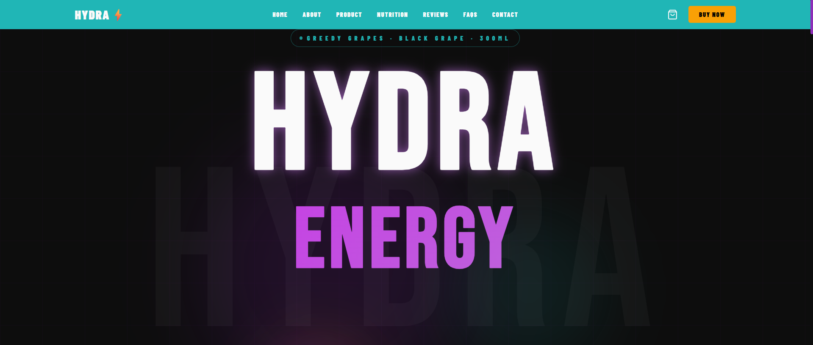
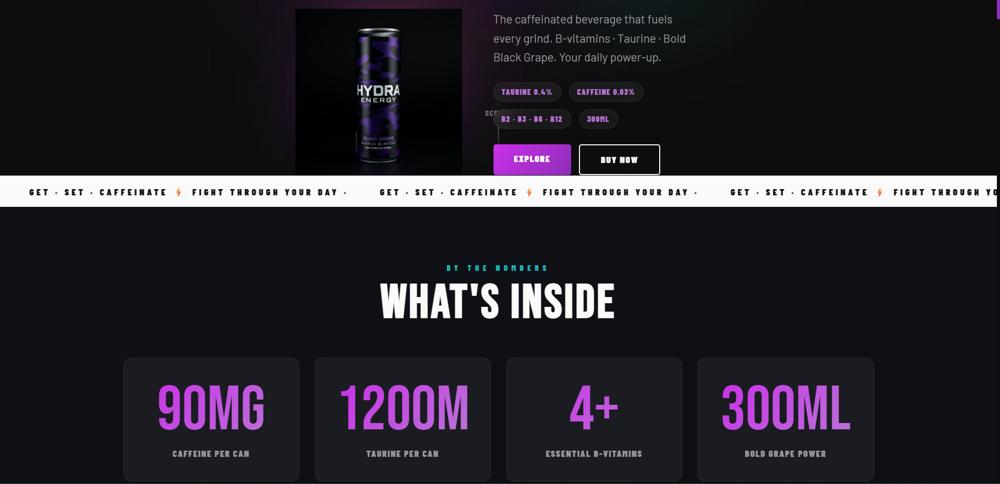
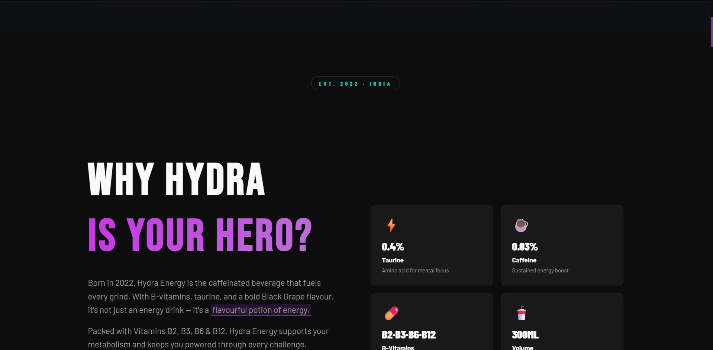
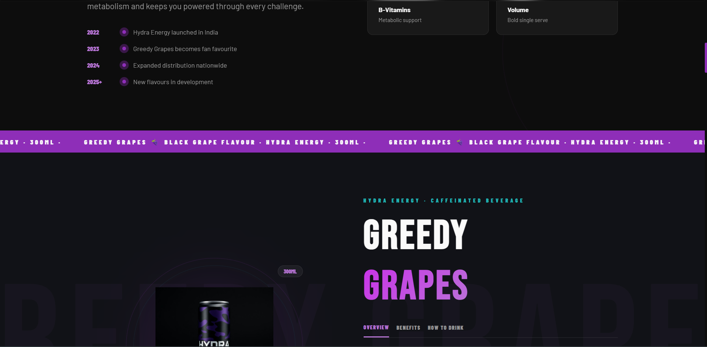
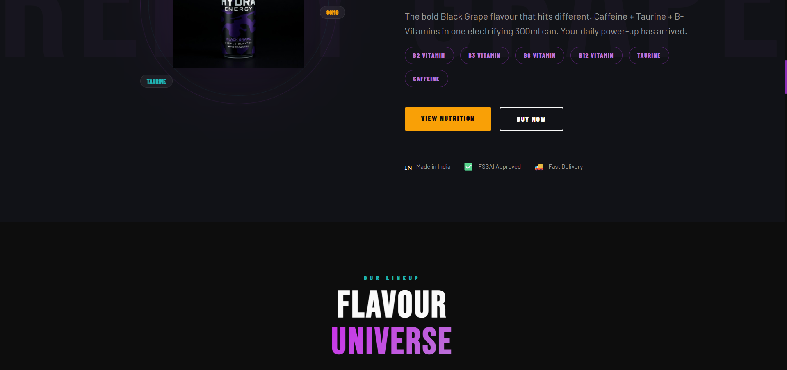
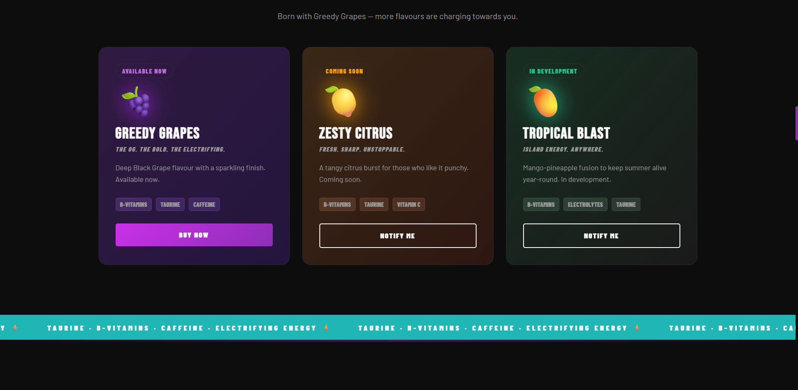
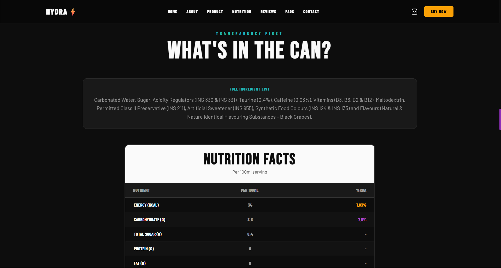
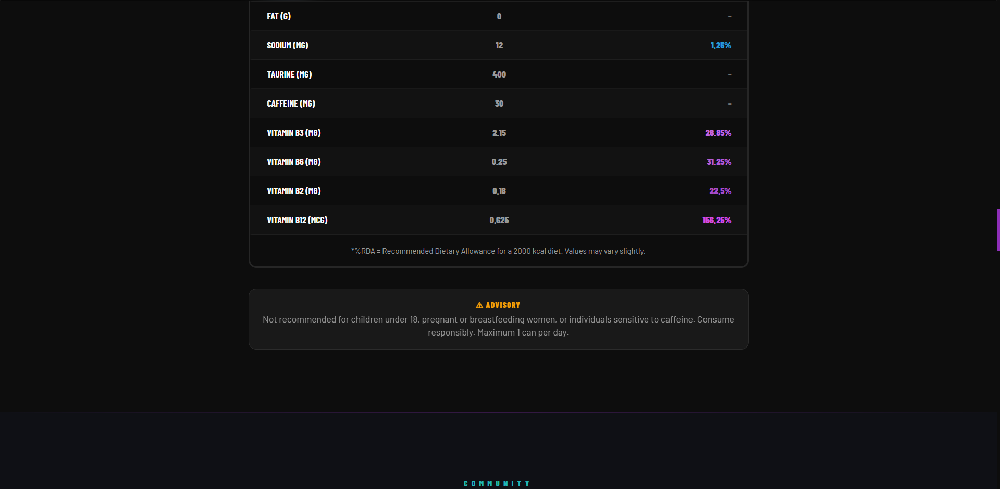
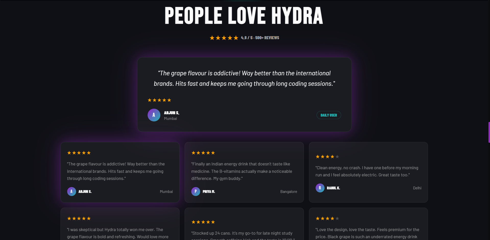
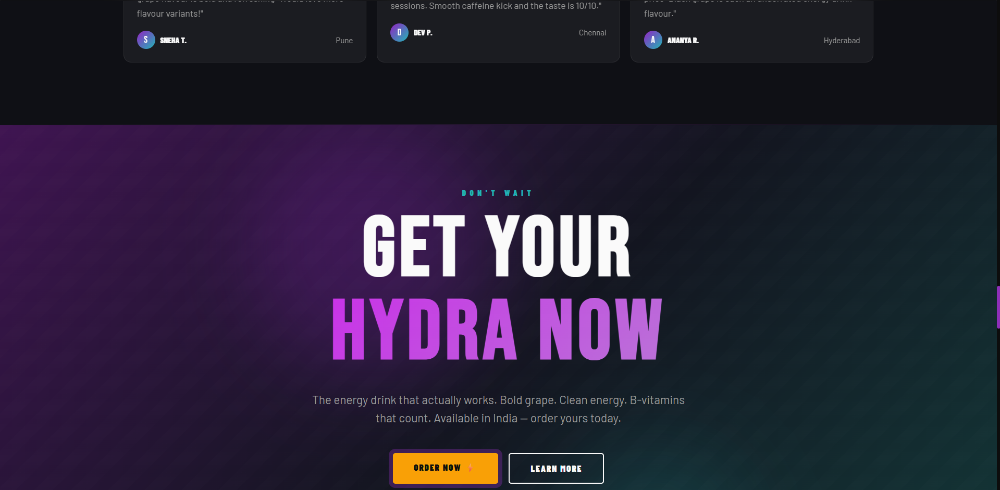
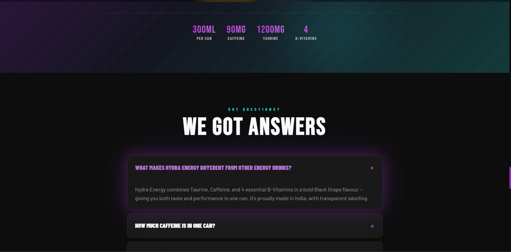
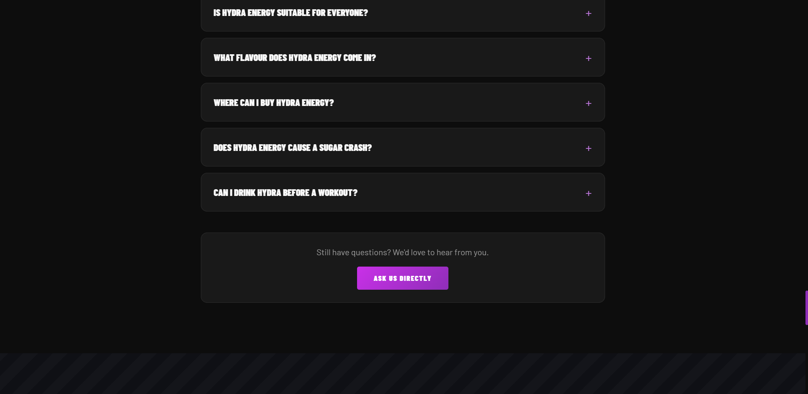
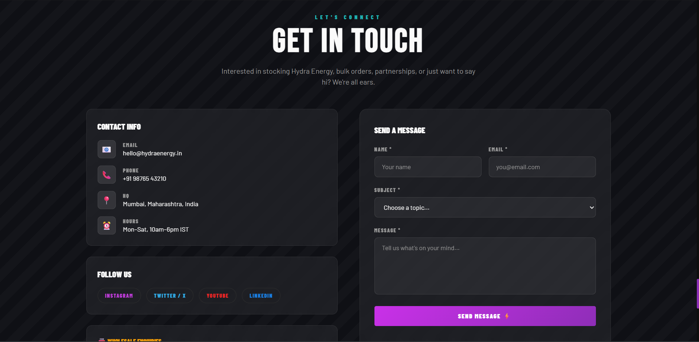
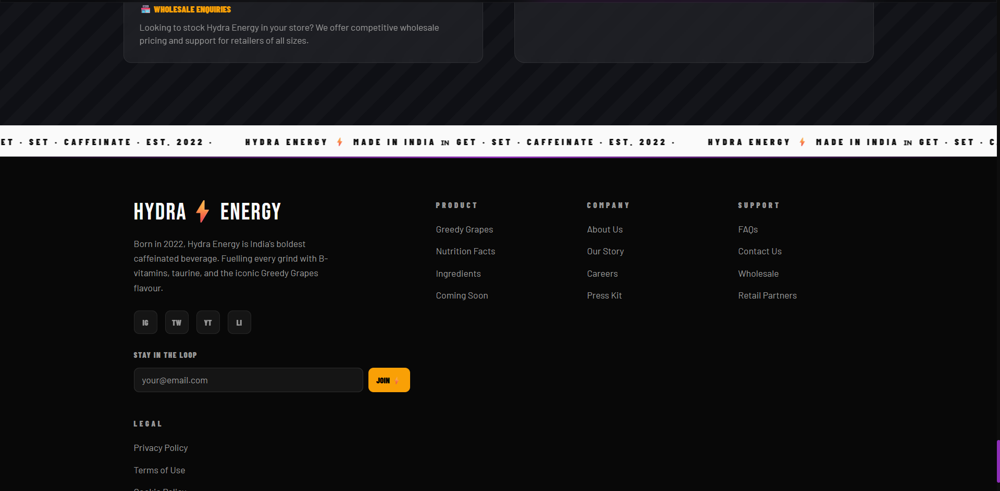

